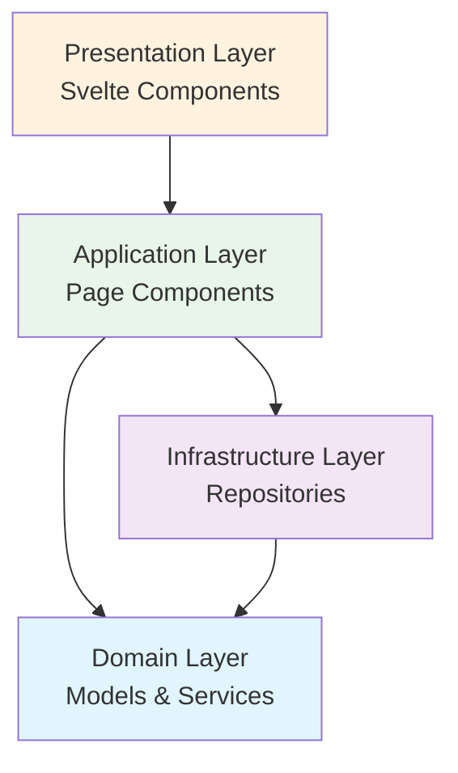
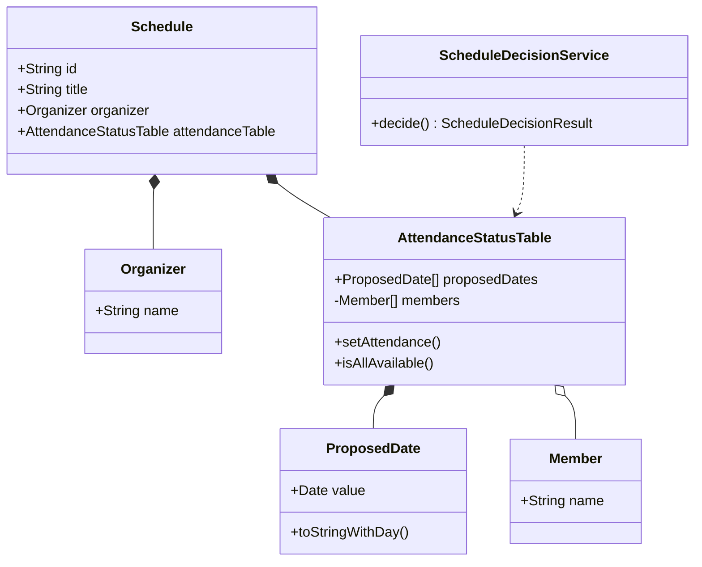
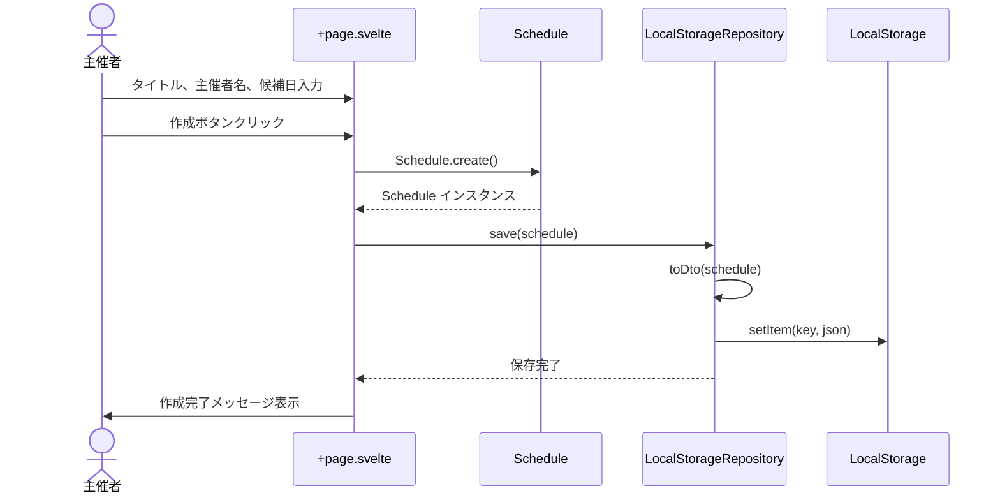
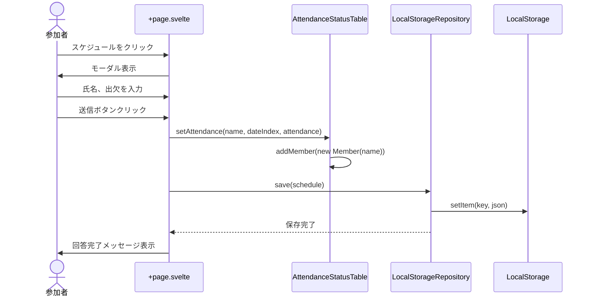
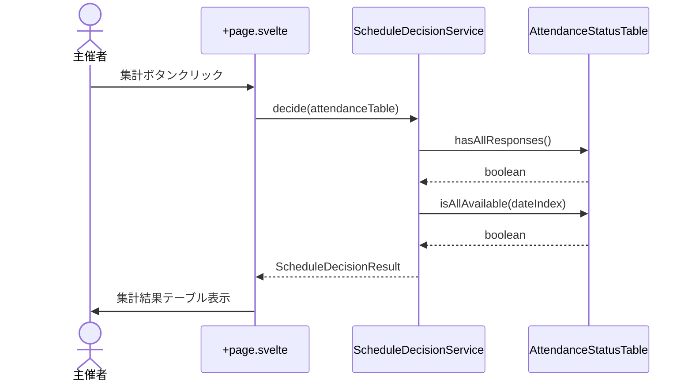

# 日程調整アプリケーション - 実装概要

## 目次

1. [概要](#概要)
2. [技術スタック](#技術スタック)
3. [アーキテクチャ](#アーキテクチャ)
4. [主要機能](#主要機能)
5. [画面構成](#画面構成)
6. [データフロー](#データフロー)
7. [ディレクトリ構成](#ディレクトリ構成)

---

## 概要

複数の候補日に対して参加者が出欠を回答し、最適な日程を決定する日程調整アプリケーション。
ドメイン駆動設計（DDD）に基づいて実装され、ローカルストレージを使用してデータを永続化する。

**主な特徴:**
- カレンダーUIによる複数日付の選択
- リアルタイムの集計表示
- ドメインロジックとインフラストラクチャの分離
- TypeScriptによる型安全な実装

---

## 技術スタック

### フロントエンド
- **Svelte 5** - UIフレームワーク
- **SvelteKit** - アプリケーションフレームワーク
- **TypeScript** - 型システム
- **CSS** - スタイリング

### データ永続化
- **LocalStorage** - ブラウザストレージ

### 設計パターン
- **ドメイン駆動設計 (DDD)** - ビジネスロジックの構造化
- **リポジトリパターン** - データアクセスの抽象化

---

## アーキテクチャ

### レイヤー構成



### ドメインモデル



---

## 主要機能

### 1. スケジュール作成（主催者）

**機能:**
- スケジュールタイトル入力
- 主催者名入力
- カレンダーで複数日付を選択
- スケジュール作成と保存

**実装ファイル:**
- `/src/routes/+page.svelte` (L121-L150)
- `/src/lib/components/MultiDatePicker.svelte`

### 2. 出欠回答（参加者）

**機能:**
- スケジュール一覧から選択
- モーダルで候補日への出欠入力
- 氏名入力
- 回答送信

**実装ファイル:**
- `/src/routes/+page.svelte` (L283-L337)

### 3. 集計・結果表示

**機能:**
- 回答者が1名以上で集計ボタン表示
- 候補日×参加者のテーブル表示
- 出席可能人数の集計
- 日程確定判定（全員○の日が1つ存在）
- 確定日の強調表示

**実装ファイル:**
- `/src/routes/+page.svelte` (L201-L275)
- `/src/lib/domain/services/ScheduleDecisionService.ts`

---

## 画面構成

### メイン画面レイアウト

```
┌─────────────────────────────────────────┐
│  日程調整アプリ - 主催者画面              │
├─────────────────────────────────────────┤
│  ┌───────────────────────────────────┐  │
│  │ 新しいスケジュールを作成           │  │
│  ├───────────────────────────────────┤  │
│  │ タイトル: [___________________]   │  │
│  │ 主催者名: [___________________]   │  │
│  │ 候補日:   [カレンダー表示]        │  │
│  │           [スケジュールを作成]    │  │
│  └───────────────────────────────────┘  │
│                                          │
│  ┌───────────────────────────────────┐  │
│  │ 作成済みスケジュール               │  │
│  ├───────────────────────────────────┤  │
│  │ ┌─────────────────────────────┐  │  │
│  │ │ チーム飲み会                 │  │  │
│  │ │ 主催者: 田中                 │  │  │
│  │ │ 候補日: 2025-10-10 (金)     │  │  │
│  │ │         2025-10-11 (土)     │  │  │
│  │ │ 回答者数: 3名               │  │  │
│  │ │ [集計] [削除]               │  │  │
│  │ │                             │  │  │
│  │ │ ┌─────────────────────────┐ │  │  │
│  │ │ │ 集計結果（テーブル）      │ │  │  │
│  │ │ │ 参加者 | 10/10 | 10/11   │ │  │  │
│  │ │ │ 山田   |   ○   |   ×     │ │  │  │
│  │ │ │ 佐藤   |   ○   |   ○     │ │  │  │
│  │ │ └─────────────────────────┘ │  │  │
│  │ └─────────────────────────────┘  │  │
│  └───────────────────────────────────┘  │
└─────────────────────────────────────────┘
```

### カレンダーコンポーネント

```
┌──────────────────────────────┐
│  ◀  2025年 10月  ▶          │
│  [今月に戻る]                │
├──────────────────────────────┤
│ 日 月 火 水 木 金 土          │
│       1  2  3  4  5          │
│  6  7  8  9 10 11 12         │
│ 13 14 15 16 17 18 19         │
│ 20 21 22 23 24 25 26         │
│ 27 28 29 30 31               │
├──────────────────────────────┤
│ 選択中の日付:                │
│ [2025-10-10 ×] [2025-10-15 ×]│
└──────────────────────────────┘
```

---

## データフロー

### スケジュール作成フロー



### 出欠回答フロー



### 集計表示フロー



---

## ディレクトリ構成

```
src/
├── lib/
│   ├── components/
│   │   └── MultiDatePicker.svelte        # カレンダーコンポーネント
│   ├── domain/
│   │   ├── models/
│   │   │   ├── Schedule.ts               # スケジュールエンティティ
│   │   │   ├── AttendanceStatusTable.ts  # 出欠表エンティティ
│   │   │   ├── valueObjects.ts           # 値オブジェクト
│   │   │   └── index.ts
│   │   ├── services/
│   │   │   ├── ScheduleDecisionService.ts # 日程決定サービス
│   │   │   └── index.ts
│   │   └── repositories/
│   │       └── ScheduleRepository.ts      # リポジトリインターフェース
│   └── infrastructure/
│       └── repositories/
│           └── LocalStorageScheduleRepository.ts # LocalStorage実装
└── routes/
    ├── +page.svelte                      # メイン画面
    ├── +page.ts                          # SSR設定
    ├── +layout.svelte                    # レイアウト
    └── +layout.ts
```

---

## 主要クラス詳細

### Schedule (エンティティ)

**責務:** スケジュール全体を管理する集約ルート

**主要メソッド:**
- `create(title, organizer, proposedDates)` - 新規作成

**ファイル:** `/src/lib/domain/models/Schedule.ts`

### AttendanceStatusTable (エンティティ)

**責務:** 出欠回答状況を管理

**主要メソッド:**
- `setAttendance(memberName, dateIndex, attendance)` - 出欠登録
- `getAttendance(memberName, dateIndex)` - 出欠取得
- `hasAllResponses()` - 全員回答済みチェック
- `isAllAvailable(dateIndex)` - 全員出席可能チェック

**ファイル:** `/src/lib/domain/models/AttendanceStatusTable.ts`

### ScheduleDecisionService (ドメインサービス)

**責務:** 最適日程を決定

**主要メソッド:**
- `decide(table)` - 日程決定
  - 全員回答済み → 全員○の日が1つ → 「確定」
  - 全員回答済み → 全員○の日なし → 「再調整」
  - 未回答者あり → 「保留」

**ファイル:** `/src/lib/domain/services/ScheduleDecisionService.ts`

### LocalStorageScheduleRepository

**責務:** LocalStorageへのデータ永続化

**主要メソッド:**
- `save(schedule)` - 保存
- `findAll()` - 全件取得
- `findById(id)` - ID検索
- `delete(id)` - 削除
- `toDto(schedule)` / `fromDto(dto)` - 変換

**ファイル:** `/src/lib/infrastructure/repositories/LocalStorageScheduleRepository.ts`

---

## 状態管理

### ページレベルの状態

```typescript
// /src/routes/+page.svelte

// フォーム入力
let scheduleTitle: string = '';
let organizerName: string = '';
let proposedDates: string[] = [];

// データ
let savedSchedules: Schedule[] = [];

// UI状態
let selectedSchedule: Schedule | null = null;
let expandedScheduleId: string | null = null;

// 回答フォーム
let memberName: string = '';
let attendanceResponses: Attendance[] = [];
```

---

## LocalStorageデータ構造

### 保存キー

```
schedules
```

### データ形式

LocalStorageには、スケジュールの配列がJSON形式で保存されます。

#### ScheduleDto 型定義

```typescript
interface ScheduleDto {
    id: string;                    // UUID
    title: string;                 // スケジュールタイトル
    organizerName: string;         // 主催者名
    proposedDates: string[];       // 候補日配列 (YYYY-MM-DD形式)
    members: string[];             // 参加者名配列
    responses: {                   // 出欠回答配列
        memberName: string;        // 回答者名
        dateIndex: number;         // 候補日のインデックス
        attendance: 'available' | 'unavailable';
    }[];
}
```

#### 保存例

```json
[
  {
    "id": "550e8400-e29b-41d4-a716-446655440000",
    "title": "チーム飲み会",
    "organizerName": "田中",
    "proposedDates": [
      "2025-10-10",
      "2025-10-11",
      "2025-10-12"
    ],
    "members": [
      "山田",
      "佐藤",
      "鈴木"
    ],
    "responses": [
      {
        "memberName": "山田",
        "dateIndex": 0,
        "attendance": "available"
      },
      {
        "memberName": "山田",
        "dateIndex": 1,
        "attendance": "unavailable"
      },
      {
        "memberName": "山田",
        "dateIndex": 2,
        "attendance": "available"
      },
      {
        "memberName": "佐藤",
        "dateIndex": 0,
        "attendance": "available"
      },
      {
        "memberName": "佐藤",
        "dateIndex": 1,
        "attendance": "available"
      },
      {
        "memberName": "佐藤",
        "dateIndex": 2,
        "attendance": "unavailable"
      },
      {
        "memberName": "鈴木",
        "dateIndex": 0,
        "attendance": "available"
      },
      {
        "memberName": "鈴木",
        "dateIndex": 1,
        "attendance": "unavailable"
      },
      {
        "memberName": "鈴木",
        "dateIndex": 2,
        "attendance": "available"
      }
    ]
  },
  {
    "id": "6ba7b810-9dad-11d1-80b4-00c04fd430c8",
    "title": "プロジェクト会議",
    "organizerName": "高橋",
    "proposedDates": [
      "2025-10-15",
      "2025-10-16"
    ],
    "members": [
      "伊藤"
    ],
    "responses": [
      {
        "memberName": "伊藤",
        "dateIndex": 0,
        "attendance": "unavailable"
      },
      {
        "memberName": "伊藤",
        "dateIndex": 1,
        "attendance": "available"
      }
    ]
  }
]
```

### データ変換処理

#### ドメインモデル → DTO（保存時）

```typescript
private toDto(schedule: Schedule): ScheduleDto {
    return {
        id: schedule.id,
        title: schedule.title,
        organizerName: schedule.organizer.name,
        proposedDates: schedule.proposedDates.map((d) => d.toString()),
        members: schedule.attendanceTable.members.map((m) => m.name),
        responses: schedule.attendanceTable.getAllResponses()
    };
}
```

#### DTO → ドメインモデル（読み込み時）

```typescript
private fromDto(dto: ScheduleDto): Schedule {
    const organizer = new Organizer(dto.organizerName);
    const proposedDates = dto.proposedDates.map((d) => ProposedDate.fromString(d));
    const members = dto.members.map((name) => new Member(name));

    const attendanceTable = new AttendanceStatusTable(proposedDates, members);

    // 回答を復元
    dto.responses.forEach((response) => {
        attendanceTable.setAttendance(
            response.memberName,
            response.dateIndex,
            response.attendance
        );
    });

    return new Schedule(dto.id, dto.title, organizer, attendanceTable);
}
```

### データアクセスパターン

#### 保存

```typescript
// 新規または既存の更新
await repository.save(schedule);
```

#### 全件取得

```typescript
const schedules = await repository.findAll();
```

#### ID検索

```typescript
const schedule = await repository.findById(id);
```

#### 削除

```typescript
await repository.delete(id);
```

### ブラウザ開発者ツールでの確認方法

1. **Chrome/Edge/Firefox開発者ツールを開く**
   - F12キーまたは右クリック → 検証

2. **Applicationタブ（またはStorageタブ）を開く**

3. **Local Storage → ファイルのオリジン を選択**

4. **`schedules`キーの値を確認**
   - JSON形式でデータが表示される

5. **データの編集・削除も可能**
   - キーをダブルクリックで編集
   - 右クリック → Delete で削除

---

## SSR対応

**課題:** LocalStorageはブラウザAPIのため、SSR環境では使用不可

**解決策:**

1. **ページレベルでSSR無効化**
   ```typescript
   // /src/routes/+page.ts
   export const ssr = false;
   ```

2. **リポジトリレベルでガード**
   ```typescript
   private isClient(): boolean {
       return typeof window !== 'undefined' && typeof localStorage !== 'undefined';
   }
   ```

3. **onMountでデータ読み込み**
   ```typescript
   onMount(() => {
       loadSchedules();
   });
   ```

---

## 今後の拡張案

### 機能追加
- [ ] スケジュールの編集機能
- [ ] 回答の修正機能
- [ ] 時間帯の追加
- [ ] メールアドレスによる一意識別
- [ ] 回答期限設定
- [ ] リマインダー機能

### 技術的改善
- [ ] Zustand/Pinia等による状態管理
- [ ] バックエンドAPI連携
- [ ] データベース永続化
- [ ] 認証・認可機能
- [ ] リアルタイム同期（WebSocket）
- [ ] PWA対応

### UI/UX改善
- [ ] レスポンシブデザイン最適化
- [ ] ダークモード対応
- [ ] アニメーション追加
- [ ] アクセシビリティ向上
- [ ] 多言語対応

---

## 開発ガイド

### セットアップ

```bash
# 依存関係インストール
npm install

# 開発サーバー起動
npm run dev

# ビルド
npm run build

# プレビュー
npm run preview
```

### 開発時の注意点

1. **ドメインロジックの純粋性**
   - ドメイン層はフレームワークに依存しない
   - ビジネスロジックはドメインサービスに集約

2. **型安全性の維持**
   - すべてのコンポーネントでTypeScript使用
   - 値オブジェクトで型を明示

3. **テスタビリティ**
   - リポジトリパターンによりモック可能
   - ドメインサービスは純粋関数

4. **SSR考慮**
   - ブラウザAPIは`onMount`内で使用
   - または`isClient()`チェックを追加

---

## まとめ

本アプリケーションは、ドメイン駆動設計の原則に従い、ビジネスロジックとインフラストラクチャを明確に分離した構造となっている。Svelteの宣言的UIとTypeScriptの型安全性により、保守性の高いコードベースを実現している。

LocalStorageによるシンプルな永続化により、サーバーレスで動作する軽量なWebアプリケーションとして完成している。
