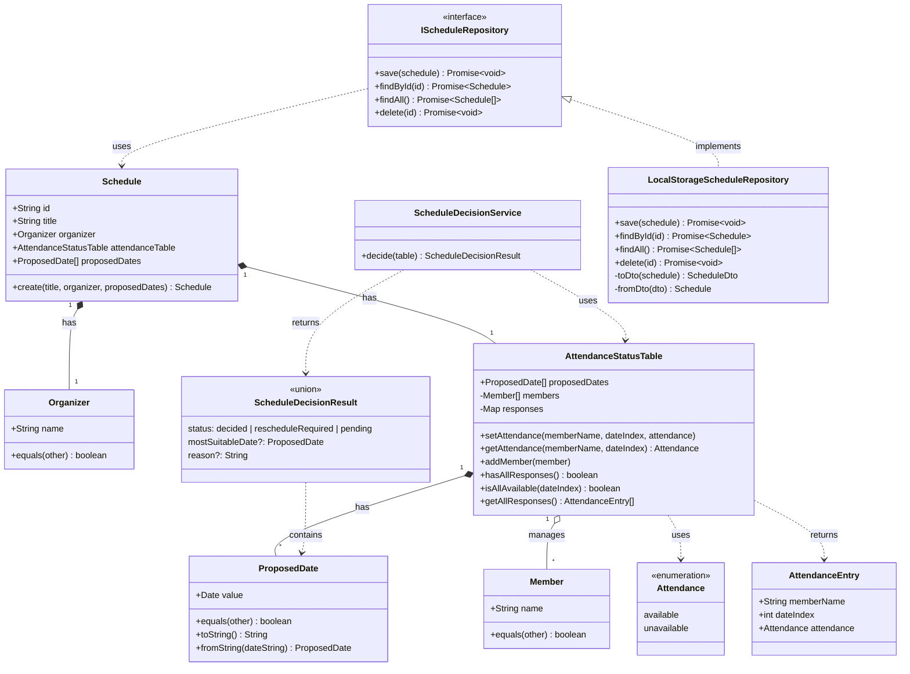

# 日程調整アプリケーション仕様

## 概要

日程調整モデル：

1. 複数の候補日(日付)に対して、参加者が出欠可否を回答する
2. 出欠回答状況(出欠表)を元に最適な日程を決定する

---

## 最適な日程の決定ルール (最小版)

最初は単純なルールでやってみる：

- 出欠は (〇 ×) のどちらかで回答
- 全員が〇の候補日が 1 つに決まれば、日程調整が完了
- それ以外は、再調整

---

## モデル駆動設計

### 1. 出欠回答状況を表現する

#### 候補日 (Proposed Date(s))

- 調整対象となる日付のリスト

#### 参加者 (Member(s))

- 出欠を回答するメンバーのリスト

#### 出欠 (Attendance)

- 各参加者の出欠状況 (〇 or ×)

#### 出欠回答状況 (Attendance Status Table)

- 候補日 × 参加者の出欠表

---

### 2. 日程調整の結果を表現する

#### 確定 (Decided)

- 最適な日付 (Most Suitable Date)
- 日程が確定した状態

#### 再調整 (Reschedule Required)

- 確定条件を満たさず、再調整が必要な状態

---

### 3. 最適日程を決定するルールを表現する

#### 回答状況の判定

- 一定の回答数が集まっていること

#### 確定状況の判定

- 日程を確定できる条件を満たしていること
  - 全員が〇の候補日が 1 つ存在する

### このアプリの動作の説明

1. スケジュール調整したい側の利用設定
   1.1. 日程調整したいスケジュールと、候補日（複数）を選択し、決定
2. 日程調整されるメンバーの動作
   2.1. 日程調整中スケジュールの一覧画面から、どのスケジュールについて回答を行うか選択
   2.2. 選んだ画面に 1.1 で決めた候補日が出るのでそこで回答を入力 yes/no のみ
   2.3. 回答者の氏名を入力して決定
3. 回答が集まった場合は、日程調整したい作成ずみスケジュールに「集計」ボタンが出る。それを押すと、現在の集計状況から集計結果が表示される。

## 詳細

1. スケジュール調整したい側（主催者）の情報

   - 主催者の氏名や識別情報は必要ですか？ 必要です。
   - 主催者自身も出欠回答しますか？しません

2. 候補日選択時の情報

   - スケジュール名/タイトルは必要ですか？（例：「打ち合わせ」「飲み会」など）必要です。
   - 日付だけでなく時間帯も必要ですか？時間帯はいまのところ不要。

3. 回答者の識別

   - 回答者の氏名のみで識別しますか？氏名のみで識別します
   - 同姓同名の可能性を考慮して、メールアドレスなどの一意な識別子は必要ですか？まずは不要です。

4. データの永続化

   - スケジュール一覧や回答状況はどこに保存しますか？（ローカルストレージ、DB、など）とりあえずローカルストレージに保存します。

5. 2.4. の続き

   - 仕様が途中で終わっていますが、何か追加内容がありますか？ありません

6. 集計ボタンの表示条件

- 「回答が集まった場合」は具体的にどのような条件ですか？一人以上の回答がある
- 少なくとも 1 人以上の回答があれば表示？そうです
- 全員の回答が揃った場合のみ？全員の定義はないので一人以上の回答で OK
- その他の条件？その他条件はいまのところなし

7. 集計結果の表示内容

- 各候補日ごとの出席可能人数・不可人数を表示？候補日に対して全員 yes なら二重丸。全員 no ならバツ。
- ドメインサービス(ScheduleDecisionService)の判定結果（確定/再調整/保留）を表示？そうです
- 確定した場合は最適日を強調表示？そうです

8. 集計結果の表示方法

- モーダルで表示？スケジュールカード内のほうで。
- スケジュールカード内に展開表示？こちらで。

---

## ドメインモデル関係図

### ドメインモデルの説明

#### エンティティ

- **Schedule**: スケジュール全体を管理する集約ルート
- **AttendanceStatusTable**: 出欠回答状況を管理するエンティティ

#### 値オブジェクト

- **Organizer**: 主催者（氏名のみ）
- **Member**: 参加者（氏名のみで識別）
- **ProposedDate**: 候補日
- **Attendance**: 出欠状況（available/unavailable）
- **AttendanceEntry**: 出欠回答のエントリ

#### ドメインサービス

- **ScheduleDecisionService**: 最適日程を決定するロジック

#### リポジトリ

- **IScheduleRepository**: リポジトリインターフェース
- **LocalStorageScheduleRepository**: LocalStorage 実装
